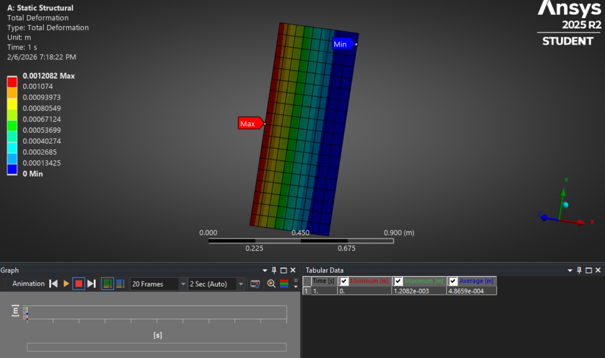
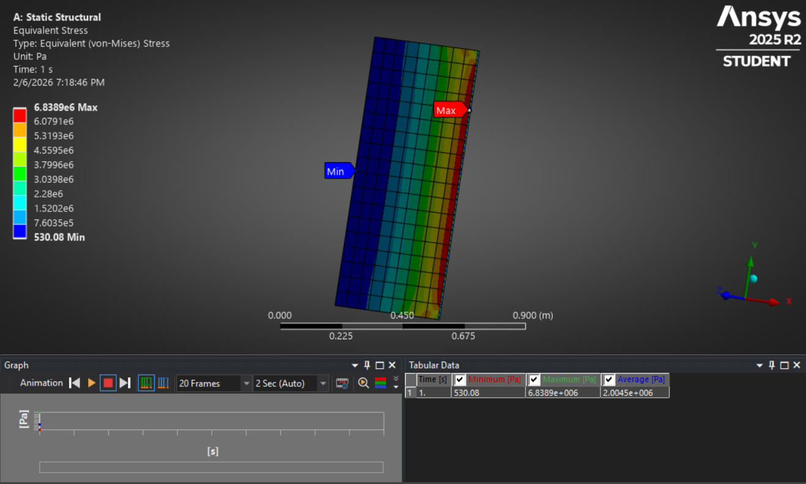

# Structural Analysis of Satellite Solar Panel (ANSYS)

## 📖 Project Overview
This project presents a **static structural finite element analysis (FEA)** of a **satellite solar panel** using **ANSYS Mechanical (2025 R2 Student Version)**.

The objective is to evaluate:
- Structural deformation
- Stress distribution
under applied loading conditions representative of operational or launch-induced loads on satellite-mounted solar panels.

This analysis demonstrates practical skills in **structural modeling, boundary condition definition, meshing, and result interpretation**, relevant to **aerospace engineering and satellite structures**.

---

## 🛰️ Physical Model Description

- **Structure**: Rectangular satellite solar panel (modeled as a thin plate)
- **Material**: Aluminum Alloy
- **Dimensions**:
  - Length (Y-direction): **1.0 m**
  - Width (X-direction): **0.5 m**
  - Thickness (Z-direction): **0.01 m**

> Orientation is intentionally chosen to reflect realistic solar panel geometry:
> - Long span in the **Y-direction**
> - Thin thickness in the **Z-direction**

---

## ⚙️ Simulation Setup

### 🔹 Analysis Type
- **Static Structural Analysis**

### 🔹 Material Properties
- Aluminum Alloy (ANSYS Engineering Data)

### 🔹 Boundary Conditions
- **Fixed Support** applied along one edge  
  (representing attachment to satellite bus or mounting frame)

### 🔹 Loading Condition
- **Uniform Pressure Load**
  - Magnitude: **1000 Pa**
  - Applied normal to the panel surface

This loading condition approximates:
- Aerodynamic loading during launch, or
- Structural stress testing scenarios.

---

## 🧩 Meshing Details
- Automatically generated structured mesh
- Adequate refinement to capture stress gradients
- Total Elements: ~162  
- Total Nodes: ~1272

---

## 📊 Results

### 1️⃣ Total Deformation
- **Maximum Deformation**:  
  **≈ 1.21 × 10⁻³ m (1.2 mm)**
- Occurs at the **free edge opposite the fixed support**
- Deformation trend shows expected cantilever-like behavior

📷 *Result visualization available in:*  

---

### 2️⃣ Equivalent (von Mises) Stress
- **Maximum Stress**:  
  **≈ 6.84 MPa**
- Stress concentration near the **fixed support region**
- Stress values are **well below the yield strength of aluminum**, indicating structural safety under applied load

📷 *Result visualization available in:*  

---

## ✅ Conclusions

- The solar panel structure remains **structurally safe** under applied static loading.
- Deformation levels are small relative to panel dimensions.
- Stress distribution follows expected physical behavior for a cantilevered thin plate.
- The analysis validates correct:
  - Boundary condition application
  - Load definition
  - Material assignment
  - Result interpretation

---

## 🛠️ Tools Used
- **ANSYS Workbench 2025 R2 (Student Version)**
- Static Structural Module
- SpaceClaim (Geometry creation)

---

## 📁 Repository Structure

Satellite-Panel-Structural-Analysis/
│

├── geometry/

│ └── NewDesign.dsco
│

├── simulation/

│ └── structural analysis of satellite solar panel by static structural.zip
│
├── results/

│ ├── total_deformation.png

│ └── equivalent_stress.png
│

└── README.md

---

## 🎯 Skills Demonstrated
- Finite Element Analysis (FEA)
- Structural mechanics
- ANSYS Mechanical workflow
- Aerospace structural reasoning
- Engineering documentation

---

## 🚀 Future Work
- Modal analysis for vibration behavior
- Thermal-structural coupling
- Composite material modeling
- Load cases simulating launch acceleration

---

## 👩‍🚀 Author
**Manya Johari**  
Aerospace Engineering | Structural Analysis | Satellite Systems

